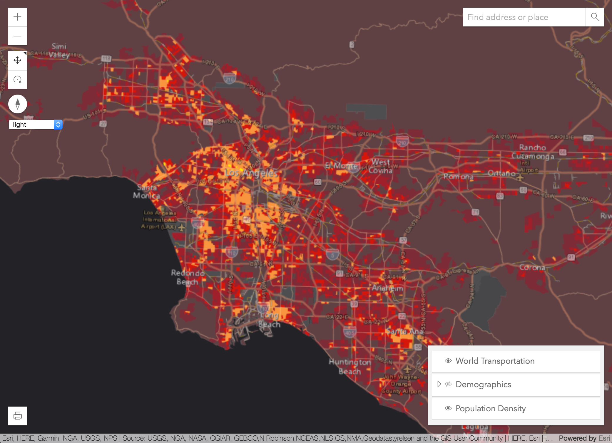
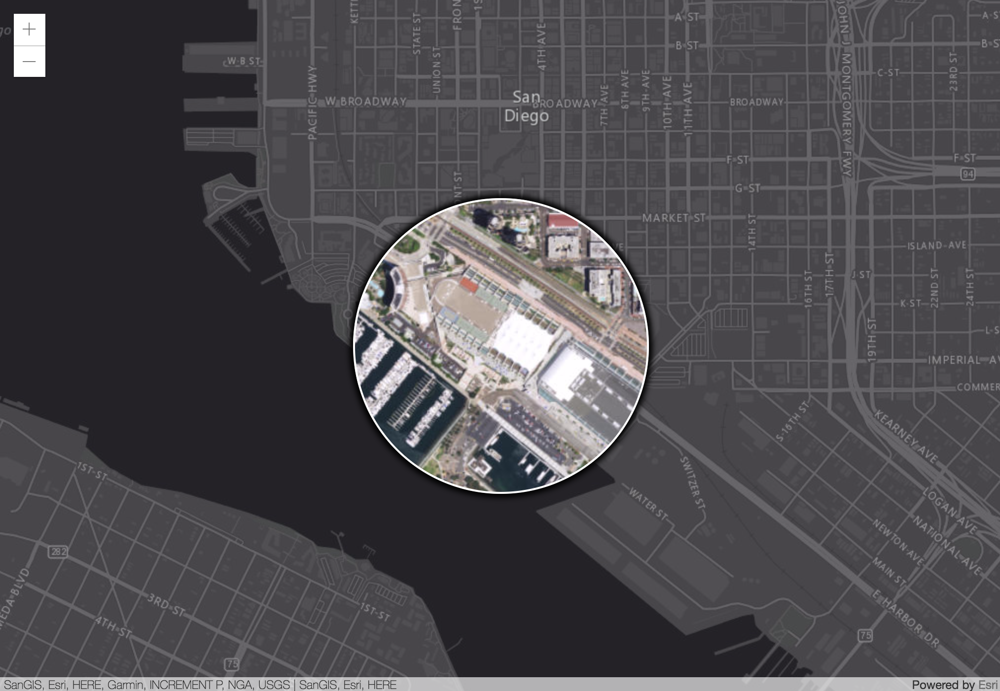

<!-- .slide: data-background="images/start-background.png" -->
<!-- Presenter: Matt -->

# Developing Your Own Widget with the ArcGIS API for JavaScript

### Matt Driscoll – [@driskull](https://twitter.com/driskull)
### JC Franco – [@arfncode](https://twitter.com/arfncode)

---

# Agenda

- About Widgets
- Theming
- Widget framework
- Putting it all together

---

# About Widgets

- What are widgets?
  - Encapsulated UI components
  - Cohesive (integrated, unified)
  - Single-purpose pieces of functionality
- Why?
  - Reusable
  - Interchangeable
- How?
  - Different frameworks are available

---

<!-- .slide: data-background="images/section-background.png" -->

# Widget Theming

---

# About

- Out-of-the-box themes
- SDK: Styling topic
- [Sass](http://sass-lang.com/)
- [BEM](http://getbem.com/)

---

# Guide

- [SDK Guide: Styles](https://developers.arcgis.com/javascript/latest/guide/styling/index.html)

---

# Out-of-the-box themes

<!-- .slide: data-background="images/demo-background.png" -->

[Theme Switcher](../demos/themes/)



---

# Sass

- CSS preprocessor
- Variables
- `@mixin` (group statements)
- `@include` - (use mixins)
- `@import` - (split up files)
- `@extend` - (inheritance)
- More power!

---

# Sass makes it easier to...

- Restyle
- Theme
- Modular / DRY
- Be organized
- Write less code :)

---

# Sass Install

- [Installing Sass](http://sass-lang.com/install)
- [Themes source on Github](https://github.com/Esri/jsapi-resources/blob/master/4.x/bower/dojo/SASS.md)

---

# [BEM](http://getbem.com/): Block Element Modifier

- Methodology to create reusable components
- Uses delimiters to separate block, element, modifiers
- Provides semantics (albeit verbose)
- Keeps specificity low
- Scopes styles to blocks

---

# [BEM](http://getbem.com/): Block Element Modifier

```css
/* block */
.example-widget {}

/* block__element */
.example-widget__input {}
.example-widget__submit {}

/* block--modifier */
.example-widget--loading {}

/* block__element--modifier */
.example-widget__submit--disabled {}
```

---

<!-- Presenter: JC -->
<!-- .slide: data-background="images/section-background.png" -->

# Widget Framework

---

# About

- `esri/widgets/Widget`
- [Widget Development](https://developers.arcgis.com/javascript/latest/guide/custom-widget/index.html#)
  - Built with TypeScript
  - Accessor-based (`esri/core/Accessor`)
  - [Implementing Accessor](https://developers.arcgis.com/javascript/latest/guide/implementing-accessor/index.html)

---

# TypeScript

- Typed JavaScript <!-- .element: class="fragment" data-fragment-index="1" -->

```ts
let view: MapView | SceneView;

// later...

// TS2322: Type '"not-a-view"' is not assignable
// to type 'MapView | SceneView'.
view = "not-a-view";
```
<!-- .element: class="fragment hidden" data-fragment-index="2" -->

---

# TypeScript

- JS of the future, now

```ts
// const
const numbers = [1, 2, 3];

// fat arrow functions
letters.forEach(letter => console.log(letter));

// template literals
const myString = `last number: ${ numbers[ numbers.length - 1 ] }`;

// decorators
class Example {
  @log
  stringify(item: object): string { /* ... */ }
}
```
<!-- .element: class="fragment" data-fragment-index="1" -->

---

# TypeScript

- IDE support
  - Visual Studio, WebStorm, Sublime, and more!  <!-- .element: class="fragment" data-fragment-index="1" -->

---

# `esri/widgets/Widget`

- Lifecycle         <!-- .element: class="fragment" data-fragment-index="1" -->
- API consistecy    <!-- .element: class="fragment" data-fragment-index="2" -->
  - Properties      <!-- .element: class="fragment" data-fragment-index="3" -->
  - Methods         <!-- .element: class="fragment" data-fragment-index="3" -->
  - Events          <!-- .element: class="fragment" data-fragment-index="3" -->

---

# Lifecycle

- constructor         <!-- .element: class="fragment" data-fragment-index="1" -->
- postInitialize      <!-- .element: class="fragment" data-fragment-index="2" -->
- render              <!-- .element: class="fragment" data-fragment-index="3" -->
- destroy             <!-- .element: class="fragment" data-fragment-index="8" -->

---

# `render`

- Defines UI                <!-- .element: class="fragment" data-fragment-index="1" -->
- Reacts to state           <!-- .element: class="fragment" data-fragment-index="2" -->
- Uses JSX                  <!-- .element: class="fragment" data-fragment-index="3" -->

```js
render() {
  const x = Number(x).toFixed(3);
  const y = Number(y).toFixed(3);
  const scale = Number(scale).toFixed(5);

  return (
    <div bind={this} class={CSS.base} onclick={this._handleClick}>
      <p>x: {x}</p>
      <p>y: {y}</p>
      <p>scale: {scale}</p>
    </div>
  );
}
```
<!-- .element: class="fragment current-visible" data-fragment-index="4" -->

---

# Defining a property

## `@property`

```ts
@property()
foo = new Foo();
```

---

# Custom setter

## `@property`

```ts
@property()
set myProperty(value: string) {
  // note internal `_set`
  this._set("myProperty", value);
  this._ensureValidity(value);
}
```

---

# Computed properties

## `@property`

```ts
@property({
  dependsOn: ["firstName, lastName"]
})
get fullName() {
  return `${this.firstName} ${this.lastName}`
}
```

---

# Read-only value

## `@property`

```ts
@property({
  readOnly: true
})
myProperty = "I'm read-only";
```

---

# Autocast

## `@property`

```ts
@property({
  type: MyClass
})
myProperty;
```

```
instance.myProperty = { /* params */ };

console.log(instance.myProperty instance of MyClass); // true
```

---

# Alias a property

## `@property`

```
@property({ aliasOf: "bar.baz" })
foo;
```

---

# Alias a property

## `@aliasOf`

```ts
@aliasOf("bar.baz")
foo;
```

---

# Handle click and key events

## `@accessibleHandler`

```ts
@accessibleHandler
private function _doSomething() {
  // ...
}
```

---

# Rendering when properties change

## `@renderable`

```ts
@property()
@renderable()
title = "hello";
```

```ts
@property()
@renderable([
  "viewModel.foo",
  "viewModel.bar"
])
viewModel = new ViewModel();
```

---

<!-- Presenter: Matt -->

# Framework: ViewModels

(The brain)

- Core logic of widget resides here
- Provides necessary APIs for the view to do it's thing
- No DOM/UI concerns (think business logic)

---

# ViewModels: Why?

- Framework integration
- Reusability
- Separates concerns

---

# Widget Framework: Views

(The face)

- `esri/widgets/Widget`
- Uses ViewModel APIs to render the UI
- View-specific logic resides here

---

# Views: Why?

- Separates concerns
- Framework compatibility

---

# Views: Defining ViewModel

```
@property({
  type: MyViewModel
})
viewModel: MyViewModel = new MyViewModel();
```

---

# Widget Framework: Method Convention

Public Methods

```
myMethod() {}
```

Private Methods

```
private _myMethod() {}
```

---

# Widget Framework: Events

- Views have ability to `emit()` an event.
- ViewModel needs to import `dojo/evented` in order to `emit()`
- Views can alias an event with `vmEvent` decorator.

---

# Widget Framework: View Events

- Widget views extend `dojo/Evented`

```
this.emit("my-event", {...});
```

---

# Widget Framework: ViewModel Events

#### 1. Import evented

```
import Evented = require("dojo/Evented");
```

#### 2. Extend Evented

```
interface MyViewModel extends Evented {
  ...
}
```

#### 3. Emit event when necessary
```
this.emit("my-event", {...});
```

---

# Widget Framework: Aliased View Events

```
@vmEvent("my-event")
@property({
  type: MyViewModel
})
viewModel: MyViewModel = new MyViewModel();
```

---

# Let's build a widget!

<!-- .slide: data-background="images/demo-background.png" -->

[Magnifier](https://jcfranco.github.io/uc-2017-developing-your-own-widget/demos/magnifier-complete)



---

# Let's build a widget!

<!-- .slide: data-background="images/demo-background.png" -->

- [Demo Start](../demos/magnifier-start/)
- [HTML Steps](https://github.com/jcfranco/uc-2017-developing-your-own-widget/blob/master/demos/HTML-steps.md)
- [ViewModel Steps](https://github.com/jcfranco/uc-2017-developing-your-own-widget/blob/master/demos/ViewModel-steps.md)
<!-- Presenter: JC -->
- [View Steps](https://github.com/jcfranco/uc-2017-developing-your-own-widget/blob/master/demos/View-steps.md)
- [Sass Steps](https://github.com/jcfranco/uc-2017-developing-your-own-widget/blob/master/demos/Sass-steps.md)

---

<!-- Presenter: Matt -->

# Lets Recap

- Widgets are single functionality ui components
- We use them for reusability/interchangability
- Widget Themes
  - SASS
- Widget Framework
- Constructing a widget
  - ViewModels
  - Views

---

## Suggested Sessions

- [ArcGIS API for JavaScript: Customizing Widgets
](https://userconference2017.schedule.esri.com/schedule/2040749922)

---

## Additional Resources

- [Styling](https://developers.arcgis.com/javascript/latest/guide/styling/index.html)
- [Implementing Accessor](https://developers.arcgis.com/javascript/latest/guide/implementing-accessor/index.html)
- [Setting up TypeScript](https://developers.arcgis.com/javascript/latest/guide/typescript-setup/index.html)
- [Widget Development](https://developers.arcgis.com/javascript/latest/guide/custom-widget/index.html)
- [JS API SDK](https://developers.arcgis.com/javascript/)

---

# Use the source, Luke

## [esriurl.com/buildwidgets-uc2017](http://esriurl.com/buildwidgets-uc2017)

---

<!-- .slide: data-background="images/survey-background.png" -->

---

# Questions?

---

# Thank you!

---

<!-- .slide: data-background="images/end-background.png" -->
